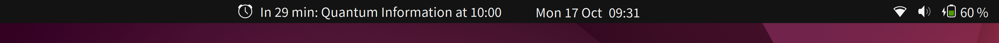
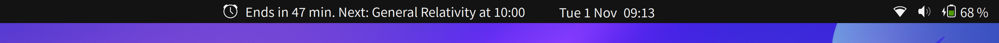
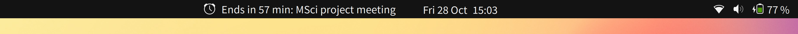
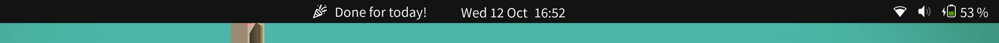

# Next Up
A GNOME Shell extension that shows your next calendar event in the status bar.

Tested on GNOME 42.4.

## Installation
You can install the extension from [the extensions.gnome.org page](https://extensions.gnome.org/extension/5465/next-up/) by clicking the switch icon.

## References
- https://gitlab.gnome.org/GNOME/gnome-shell/-/blob/main/js/ui/calendar.js
- https://extensions.gnome.org/extension/4448/next-meeting/
- https://github.com/corecoding/Vitals

- [Party popper icon](https://www.flaticon.com/free-icon/party-popper_6335608) by [Ayub Irawan](https://www.flaticon.com/authors/ayub-irawan)
